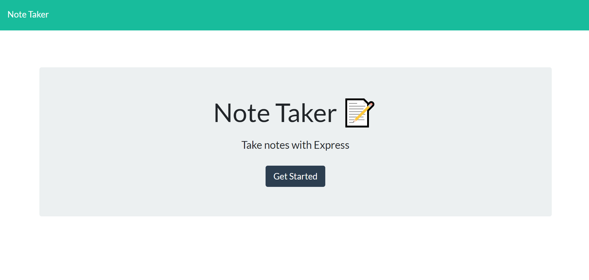
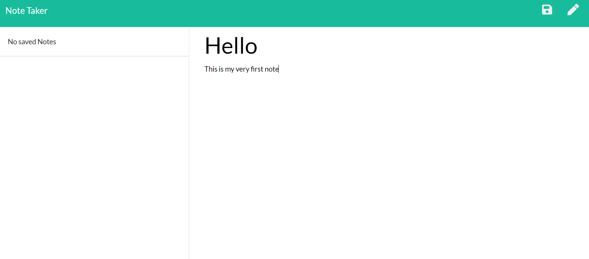
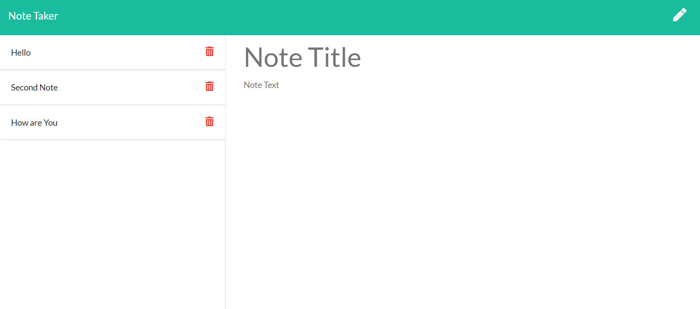
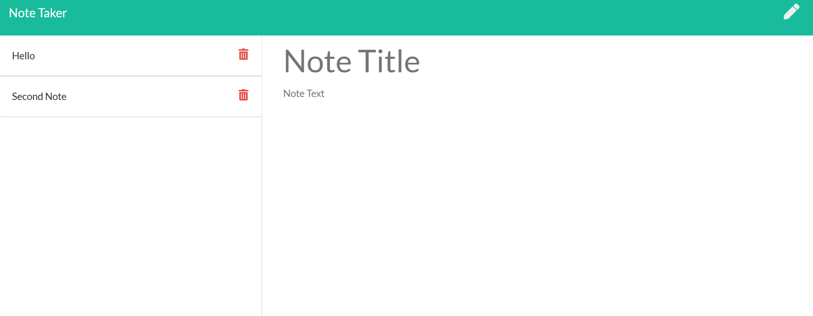

# Note Taker

For users that need to keep track of a lot of information, it's easy to forget or be unable to recall something important. Being able to take persistent notes allows users to have written information available when needed.

This note taker utilizes Node.js and Express to develop the backend portion. Using Express, this application can take notes, save them, and delete whichever one the user chooses. 

## Links

[Repo](https://github.com/MCui1997/Note-Taker)

[Heroku]

## User Story
```
AS A user, I want to be able to write and save notes
I WANT to be able to delete notes I've written before
SO THAT I can organize my thoughts and keep track of tasks I need to complete
```
## Screenshots

1. Main page of the note taker


2. Blank Note Template


3. Inputting Notes


4. Deleting Notes
